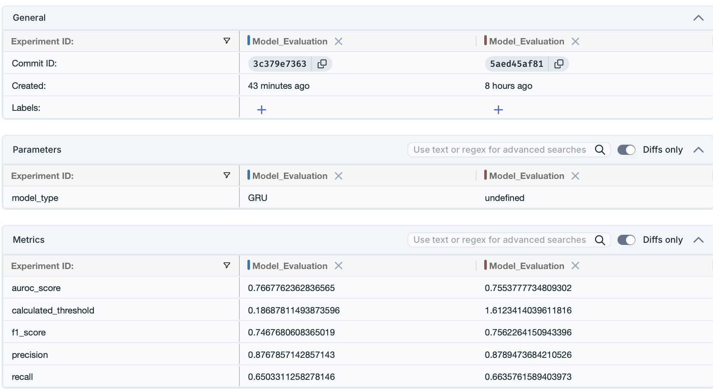
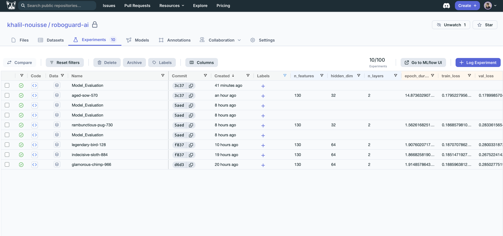
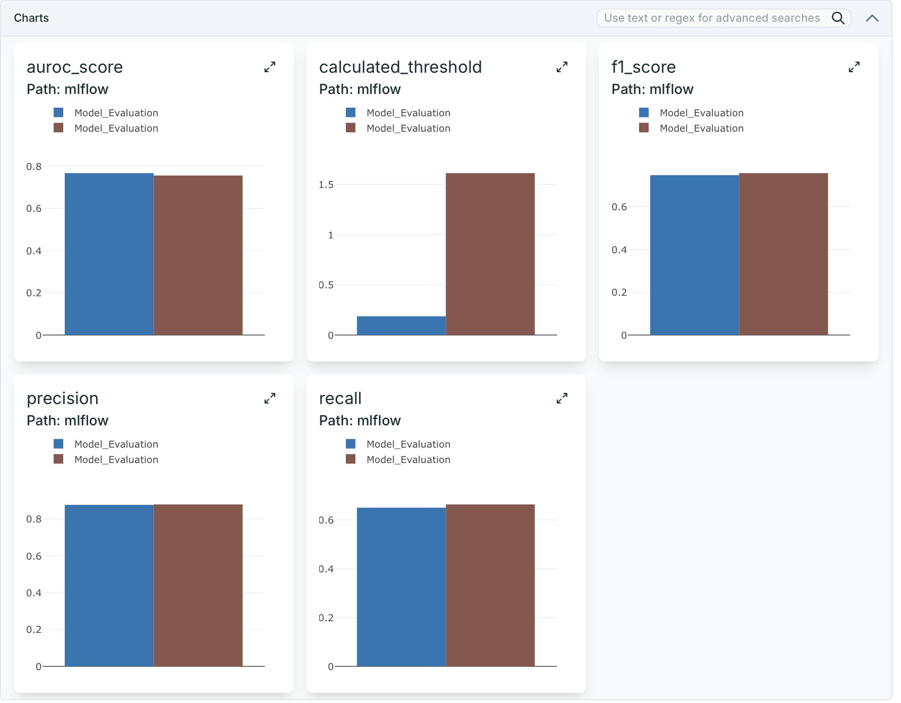

# RoboGuard-AI

An End-to-End Deep Learning & MLOps System for Multivariate Time-Series Anomaly Detection in Robotic Systems

⸻

## Overview

RoboGuard-AI is a complete Deep Learning and MLOps system designed from the ground up to detect anomalies in robotic operations using multivariate time-series data. 

This project goes beyond just training a model in a Jupyter notebook; it demonstrates how to move from a research idea to a **production-ready AI system**. It covers:
*   **Model Development:** LSTM and GRU Autoencoders for unsupervised anomaly detection.
*   **MLOps Engineering:** Containerized orchestration, real-time inference APIs, custom telemetry, and dashboard visualizations.

The system focuses on identifying catastrophic manufacturing faults such as:
*   Axis wear and mechanical degradation
*   Gripping failures in pick-and-place operations
*   Sensor inconsistencies and abnormal vibrations

⸻

## Key Features

### 🧠 Deep Learning
*   **Architectures:** Support for both **LSTM** and **GRU** Autoencoders configured dynamically via YAML.
<div align="center">
  
</div>

*   **Temporal Awareness:** Multivariate time-series modeling (130 distinct robot features over 250-timestep windows).
*   **Unsupervised Detection:** Flags anomalies using reconstruction error (MSE) bounded by statistical thresholds.

### ⚙️ MLOps & Infrastructure
*   **Real-time Inference API:** FastAPI application serving predictions dynamically.
*   **Telemetry & Observability:** Custom Prometheus instrumentation exporting metrics (e.g., `roboguard_anomalies_total`).
*   **Live Dashboards:** Grafana dashboards analyzing detection rates in real-time.
*   **Containerization:** Fully dockerized stack (`docker-compose`) containing the API, Prometheus database, and Grafana UI.
*   **Experiment Tracking:** Built to interface with MLflow & DagsHub for tracking parameters and model metrics.

<div align="center">
  
  <br/><br/>
  
</div>

⸻

## System Architecture

This project is structured as a full ML lifecycle pipeline:

```text
[Data Engineering] → [Model Development] → [Deployment] → [Monitoring]
```

### Detailed Flow
1. **Sensors:** 130-feature data stream is captured from the robot.
2. **Preprocessing:** Python engine scales and windows data (`250x130`).
3. **Inference:** The FastAPI container passes tensors to the loaded PyTorch Autoencoder.
4. **Scoring:** High Mean Squared Error (MSE) triggers an "Anomaly" flag.
5. **Telemetry:** Prometheus scrapes the `/metrics` endpoint on the API to increment anomaly counters.
6. **Dashboarding:** Grafana constantly visualizes the health of the robotics stream.

⸻

## Tech Stack
*   **Languages:** Python
*   **Deep Learning:** PyTorch, NumPy, Pandas
*   **Serving:** FastAPI, Uvicorn (Robust error-handling and dynamic weight loading)
*   **MLOps Monitoring:** Prometheus, Grafana, `prometheus-fastapi-instrumentator`
*   **Orchestration:** Docker, Docker Compose

⸻

## Getting Started

### 1. Clone the repository
```bash
git clone https://github.com/your-username/roboguard-ai.git
cd roboguard-ai
```

### 2. Configure the Model
You can define whether you want to use the `GRU` or `LSTM` autoencoder in `configs/config.yaml`. The API is written defensively to handle whatever structure you dictate, pulling the appropriate weights dynamically.

### 3. Boot the Production Stack
You do not need to boot individual services. The entire ecosystem (API, Prometheus, Grafana) orchestrates together:
```bash
docker compose up --build -d
```

### 4. Verify Endpoints
*   **API Docs:** `http://localhost:8000/docs`
*   **Prometheus Metrics:** `http://localhost:8000/metrics`
*   **Liveness:** `http://localhost:8000/healthz`
*   **Readiness:** `http://localhost:8000/readyz`
*   **Grafana Dashboard:** `http://localhost:3000` (Login: admin/admin)

### 5. Generate Test Traffic
To simulate the robot sending telemetry, run the test script. This will fire random noise into the API, forcing the Autoencoder to trigger anomaly alarms, which you can see spike live in Grafana!
```bash
python -m tests.test_traffic
```

⸻

## Project Structure

```text
roboguard-ai/
│
├── api/                # FastAPI service & Pydantic schemas
├── configs/            # config.yaml (Hyperparameters, Model Type GRU/LSTM)
├── data/               # Raw & processed datasets 
├── docker/             # Docker configuration (Dockerfile.api)
├── grafana/            # (Optional) Grafana provisioning definitions
├── models/             # PyTorch state_dicts (.pth) & Scikit-learn scalers (.pkl)
├── monitoring/         # prometheus.yml config files
│
├── src/
│   ├── data/           # Data ingestion & validation scripts
│   ├── features/       # Preprocessing & time-series windowing
│   ├── models/         # PyTorch architectures (autoencoder.py)
│   ├── training/       # Training loops
│   └── inference/      # Robust Detection logic & PyTorch bridging (predict.py)
│
├── tests/              # Traffic simulation (test_traffic.py)
├── docker-compose.yml  # Container orchestration
├── requirements.txt    # Python dependencies
└── README.md
```

⸻

## Contributing

Contributions are welcome! Feel free to open issues or submit pull requests.

⸻

## 👤 Author

**Khalil Ait Nouisse**  
Software Engineering Student | ML & AI Enthusiast
